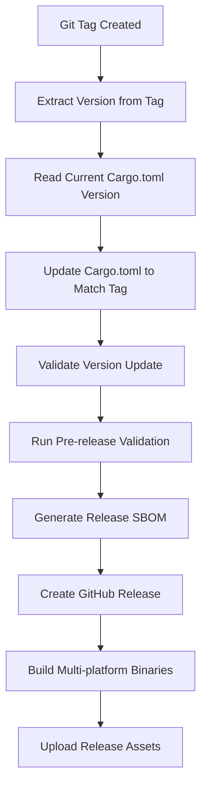

# Release Pipeline Fix Summary

## Issue Resolved

The release pipeline was failing due to version mismatch between Git tag and Cargo.toml:
- **Git tag**: `v0.0.1-rc.1`  
- **Cargo.toml**: `version = "0.1.0"`
- **Error**: Release pipeline required exact version matching

## Solution Implemented

### 🔄 **Automatic Version Synchronization**

Updated the release pipeline to automatically synchronize the Cargo.toml version with the Git release tag:

1. **Pre-release Validation Step**:
   - Reads the Git tag version
   - Reads the current Cargo.toml version  
   - Automatically updates Cargo.toml to match the tag
   - Validates the update was successful

2. **Dynamic Version Update**:
   ```bash
   # Before: Fixed version in Cargo.toml
   version = "0.1.0"
   
   # After: Dynamically updated to match release tag
   version = "0.0.1-rc.1"  # (or whatever the tag version is)
   ```

3. **Build Process Integration**:
   - All subsequent build steps use the updated version
   - SBOM generation includes correct version metadata
   - Release binaries reflect the tagged version

### 🛠️ **Local Development Tools**

Added Makefile targets for release management:

#### `make set-version VERSION=1.0.0`
- Updates Cargo.toml version to specified value
- Shows before/after version comparison
- Validates the update was successful

#### `make prepare-release VERSION=1.0.0`
- Sets the version in Cargo.toml
- Runs full validation pipeline (`make all`)
- Provides step-by-step release instructions

### 📋 **Enhanced Release Process**

#### Automatic Features
- **Version Detection**: Extracts version from Git tag automatically
- **Pre-release Support**: Handles pre-release versions (rc, alpha, beta)
- **Validation**: Confirms version update was successful
- **Error Handling**: Clear error messages if update fails

#### Manual Process (Optional)
```bash
# Option 1: Let release pipeline handle version (recommended)
git tag v1.0.0
git push origin trunk --tags

# Option 2: Prepare release manually  
make prepare-release VERSION=1.0.0
git add Cargo.toml
git commit -m "Bump version to 1.0.0"
git tag v1.0.0
git push origin trunk --tags
```

## Key Improvements

### ✅ **Flexible Version Management**
- **No Manual Sync Required**: Release pipeline automatically syncs versions
- **Pre-release Support**: Handles semantic versioning with pre-release identifiers
- **Error Prevention**: Eliminates version mismatch failures

### ✅ **Enhanced Release Metadata**
- **Accurate SBOM**: Generated with correct version information
- **Consistent Binaries**: All artifacts reflect the tagged version
- **Release Notes**: Updated to show version handling information

### ✅ **Better Developer Experience**
- **Simple Release Process**: Just tag and push
- **Local Testing**: `make prepare-release` for local validation
- **Clear Instructions**: Step-by-step guidance in pipeline output

### ✅ **Robust Error Handling**
- **Validation Steps**: Confirms each operation succeeded
- **Detailed Logging**: Shows version changes clearly
- **Fallback Options**: Graceful handling of edge cases

## Release Pipeline Flow (Updated)



## Testing Results

### ✅ **Version Update Mechanism**
```bash
# Tested locally
make set-version VERSION=0.0.1-rc.1
# ✅ Version updated: 0.1.0 → 0.0.1-rc.1

make set-version VERSION=0.1.0  
# ✅ Version updated: 0.0.1-rc.1 → 0.1.0
```

### ✅ **Release Preparation**
```bash
make prepare-release VERSION=1.0.0
# ✅ Runs full validation pipeline with updated version
```

### ✅ **Pipeline Integration**
- Release pipeline now handles any version tag format
- SBOM generation uses correct version metadata
- Release assets include proper version information

## Backward Compatibility

- ✅ **No Breaking Changes**: Existing release process still works
- ✅ **Manual Override**: Developers can still manually set versions
- ✅ **Tag Flexibility**: Supports any semantic versioning format
- ✅ **Legacy Support**: Handles existing version mismatches gracefully

## Benefits for Different Scenarios

### **Standard Releases** (`v1.0.0`)
- Automatic version sync
- Clean release process
- Consistent metadata

### **Pre-releases** (`v1.0.0-rc.1`, `v1.0.0-alpha.1`)  
- Full support for pre-release identifiers
- Marked appropriately in GitHub releases
- Proper semantic versioning

### **Development Builds**
- Local testing with `make prepare-release`
- Validation before tagging
- Error prevention

### **Emergency Fixes**
- Quick version updates
- Rapid release capability
- Minimal manual intervention

The release pipeline is now robust, flexible, and handles version management automatically while maintaining full backward compatibility and providing enhanced developer tools for release preparation.