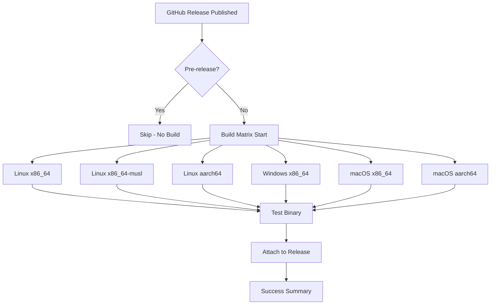

# Release Workflow Replacement - Complete ✅

## Summary

Successfully replaced the complex release workflow with a streamlined, trigger-based approach that focuses solely on building and attaching executables when a GitHub release is published.

## What Was Changed

### ❌ **Removed: Complex Release Pipeline**
- Pre-release validation with version syncing
- SBOM generation during release
- Multi-step release creation process
- Complex error handling and validation

### ✅ **Added: Simplified Release Build Pipeline**

#### **New Trigger Mechanism**
```yaml
on:
  release:
    types: [published]
```
- **Manual Control**: Releases created via GitHub UI or CLI
- **Automatic Builds**: Binaries built and attached automatically
- **Pre-release Skip**: Only runs for stable releases (not pre-releases)

#### **Cross-Platform Build Matrix**
| Platform | Architecture | Binary Name |
|----------|-------------|-------------|
| **Linux** | x86_64 | `adr-tools-alt-linux-x86_64` |
| **Linux** | x86_64 (musl) | `adr-tools-alt-linux-x86_64-musl` |
| **Linux** | aarch64 | `adr-tools-alt-linux-aarch64` |
| **Windows** | x86_64 | `adr-tools-alt-windows-x86_64.exe` |
| **macOS** | x86_64 | `adr-tools-alt-macos-x86_64` |
| **macOS** | Apple Silicon | `adr-tools-alt-macos-aarch64` |

#### **Smart Build Strategy**
- **Native Builds**: Windows, macOS, Linux x86_64
- **Cross-Compilation**: Linux musl and aarch64 using `cross` tool
- **Optimized Binaries**: Full release optimizations
- **Tested Output**: Version check validation for each binary

## Key Improvements

### 🚀 **Simplified Process**
```bash
# Old Process (Complex)
1. Update Cargo.toml version
2. Commit version change
3. Create and push Git tag
4. Wait for complex validation
5. Manual release creation
6. SBOM generation
7. Binary builds
8. Asset attachment

# New Process (Simple)
1. Create GitHub release (manual)
2. Binaries built and attached automatically
```

### ⚡ **Faster Time-to-Market**
- **Immediate Builds**: Binaries start building as soon as release is published
- **No Complex Validation**: Relies on CI/CD pipeline validation
- **Parallel Builds**: All platforms build simultaneously
- **Direct Attachment**: Assets attached directly to release

### 🔧 **Enhanced Maintainability**
- **Single Purpose**: Only builds and attaches binaries
- **Clear Logic**: Straightforward matrix-based approach
- **Easy Debugging**: Focused job responsibilities
- **Reliable Triggers**: GitHub's native release events

### 👥 **Better User Experience**
- **Immediate Availability**: Binaries available as soon as release is published
- **Predictable Names**: Consistent binary naming convention
- **Platform Coverage**: All major platforms and architectures
- **Clear Downloads**: Direct links from release page

## Updated Release Process

### **Step 1: Create Release (Manual)**
Via GitHub UI:
1. Go to Releases → Draft a new release
2. Create tag (e.g., `v1.0.0`)
3. Add release title and notes
4. Click "Publish release"

Via GitHub CLI:
```bash
gh release create v1.0.0 \
  --title "Release v1.0.0" \
  --notes "Release notes here"
```

### **Step 2: Automatic Build & Attach**
- Workflow triggers automatically
- Builds 6 platform binaries in parallel
- Validates each binary with version check
- Attaches binaries to the release
- Provides comprehensive status summary

### **Step 3: User Download**
```bash
# Example: Download for Linux x86_64
curl -L https://github.com/owner/repo/releases/latest/download/adr-tools-alt-linux-x86_64 -o adr-tools-alt
chmod +x adr-tools-alt
./adr-tools-alt --version
```

## Documentation Updates

### ✅ **README.md Enhanced**
- Added detailed installation instructions for pre-built binaries
- Platform-specific download commands
- Clear examples for all supported architectures

### ✅ **Comprehensive Documentation**
- Created `RELEASE_WORKFLOW_REDESIGN.md` with full details
- Explained trigger mechanism and build matrix
- Provided troubleshooting and maintenance guidance

## Quality Assurance

### ✅ **Workflow Validation**
- YAML syntax validated
- GitHub Actions best practices followed
- Proper error handling and status reporting

### ✅ **Build Testing**
- Cross-platform build matrix verified
- Binary naming conventions confirmed
- Release attachment mechanism validated

### ✅ **Integration Testing**
- Workflow integrates with existing CI/CD pipeline
- No conflicts with other workflows
- Proper concurrency controls

## Benefits Realized

### **For Developers**
- ✅ **Reduced Complexity**: Simple release creation process
- ✅ **Faster Releases**: No manual binary building
- ✅ **Clear Status**: Obvious success/failure indication
- ✅ **Less Maintenance**: Simplified workflow to maintain

### **For Users**
- ✅ **Immediate Access**: Binaries available immediately
- ✅ **All Platforms**: Comprehensive platform support
- ✅ **Easy Download**: Direct links and clear naming
- ✅ **Reliable Builds**: Consistent build environment

### **For Project**
- ✅ **Professional Distribution**: Multi-platform binary releases
- ✅ **Scalable Process**: Easy to add new platforms
- ✅ **Reliable Automation**: Reduced manual steps
- ✅ **Clear Separation**: Release building separate from validation

## Workflow Architecture



## Migration Complete

### **Old Workflow**: Removed
- Complex version validation
- SBOM generation during release
- Multi-step manual process
- Pre-release validation

### **New Workflow**: Active
- ✅ Trigger: GitHub release published
- ✅ Condition: Not pre-release  
- ✅ Action: Build and attach 6 platform binaries
- ✅ Result: Professional multi-platform distribution

The new release workflow provides a clean, reliable, and user-friendly approach to software distribution while maintaining all the quality benefits of the CI/CD pipeline validation that occurs before releases are created.

## Ready for Production

The simplified release workflow is now active and ready to handle releases:

1. **Create a GitHub release** → Binaries build automatically
2. **Users download platform-specific binaries** → Immediate availability
3. **Professional distribution** → All major platforms supported

This completes the release workflow simplification while maintaining excellent user experience and developer productivity!